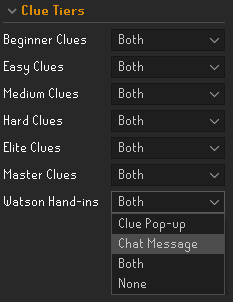
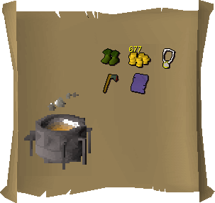
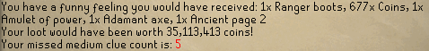
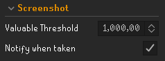

    
    <h3>Missed Clues</h3>
    <h4>You haven't got a clue what you're missin'</h4>

### Features
* If the message "You have a sneaking suspicion that you would have received a clue..." is received, the plugin simulates a clue of that tier, as if you had received and completed it!
* Casting alchemy on a clue also counts as missed for that tier of clue.
* Upon receiving a master clue scroll from Watson, all of the handed-in clues can also be simulated.
* Tracks the number of missed clues you've (not) received, by tier.
* Makes you wonder about what could have been.

### Configuration

#### Clue Tiers

Configuration is available on a tier-by-tier basis with the following configuration options available:
* <b>Clue Pop-up</b>: Shows all simulated clue items in the 'incinerator clue scroll' pop-up window:

  
* <b>Chat Message</b>: Shows all simulated clue items in the chatbox, alongside estimate value and 'KC':
  
* <b>Both</b>: Shows both the Chat Message & Clue Pop-up (default)
* <b>None</b>: Shows neither (This still tracks your clues killed count!)

#### Screenshot

* <b>Valuable Threshold</b>: Sets the default value for taking a screenshot of any missed clues
* <b>Notify when taken</b>: Sends a notification when a screenshot is taken

### Changelog
* v1.1: Updated options for setting how to display clues and added clue counts.
* v1.2: Added Watson hand-ins, alched clue support, screenshot functionality, !lastmissed and !missed (tier) game chat commands

<i>Special thanks to ste for all his help on this. Couldn't have done it without you.</i>