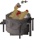

    
    <h3>Missed Clues</h3>
    <h4>You haven't got a clue what you're missin'</h4>

#### Features
* If the message "You have a funny feeling like you would have received a clue..." is received, simulates a clue of that tier, as if you had received and completed it!
* Shows the items and current GE value of these items
* Makes you wonder about what could have been
* All clue tiers supported

Special thanks to ste for all his help on this. Couldn't have done it without you.
